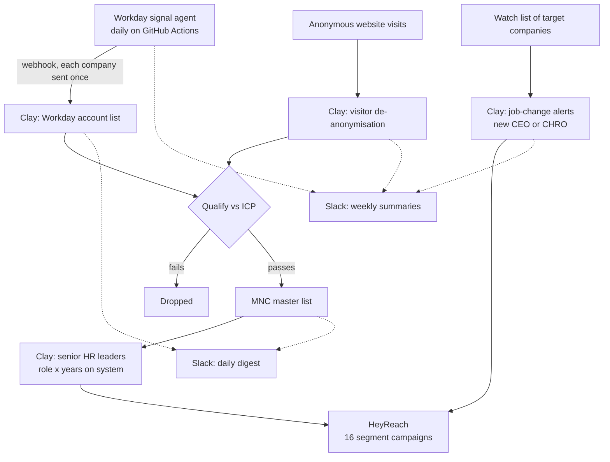

# clay-playbook

The Clay systems I built for a client, and how they plug into my agents.

The client is a global payroll-data platform that sells to large multinationals, the kind of company where payroll runs on different providers in every country and the data never lines up. My job was to find those companies on real buying signals, get to the right people there and run the outreach.

I ended up with four Clay systems live, one agent feeding them and a set of Slack digests so the team could see what was happening without opening Clay.

This repo is the write-up of how it's built. No client data, no results, no table IDs, no keys. Just how each table works and why I set it up that way.

## The whole flow



## The four systems

| # | System | What it does |
|---|---|---|
| 1 | [Workday account list](systems/01-workday-accounts.md) | Takes companies the agent found running Workday, checks them against the ICP |
| 2 | [MNC list and HR leaders](systems/02-mnc-hr-leaders.md) | The master list of multinationals, plus the senior people to contact at each |
| 3 | [Website visitors](systems/03-website-visitors.md) | Works out which companies were on the website without filling anything in |
| 4 | [Job-change alerts](systems/04-job-change-alerts.md) | Watches a set of companies and flags a new CEO or CHRO |

## How it connects to the agents

The first system is fed by an agent, not by me. It finds companies running Workday from their public careers pages and posts them into Clay through a webhook. A ledger makes sure each company goes in once, so I never pay Clay twice for the same row. That agent is public here: [workday-signal-agent](https://github.com/kari-fakh12/workday-signal-agent).

The same repo has the daily Slack digest (how many companies went to Clay today, how many qualified ones landed in the master list) and the weekly summary for the agent.

Two more weekly summaries run on Mondays for the new CEO/CHRO table and the website visitor table. Cleaned versions are in [digests/](digests/). They read the Notion table the Clay flow writes to and post a short count to Slack, with a warning if nothing new came in that week, because a quiet week usually means the flow broke, not that the market went quiet.

## The outreach test

I didn't want one big campaign where nobody knows what worked. So I split the leads into 16 segments before sending anything: four buyer roles times four tiers of how long the company had been on its HR system. Every result could be traced back to one cell, so when a segment didn't work I could cut it, and when one did I could move budget there. Full design in [outreach/segmentation-test.md](outreach/segmentation-test.md).

## Also in here

- [PLAYBOOK.md](PLAYBOOK.md): my notes on using Claude Code with Clay without burning your credits. Conditional runs, testing on 10 rows, own API keys, the prompt I run before Claude builds anything.

Before this I'd used Clay on smaller things: a workflow that found 13 companies needing GTM engineering services, and a table of 100 high-fit B2B companies built from growth signals and ICP rules. The habits in the playbook come from those.

## Layout

```
README.md
PLAYBOOK.md
systems/
  01-workday-accounts.md
  02-mnc-hr-leaders.md
  03-website-visitors.md
  04-job-change-alerts.md
outreach/
  segmentation-test.md
digests/
  ceo_chro_weekly.py
  website_visitors_weekly.py
LICENSE
```

Karim Fakhri, GTM Engineer. MIT licensed.
